WasteBook
=========================
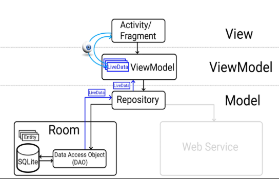

Introduction
------------
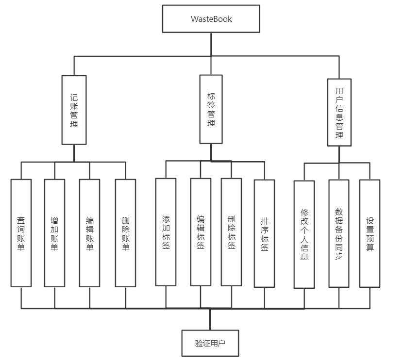

Screenshots
-----------

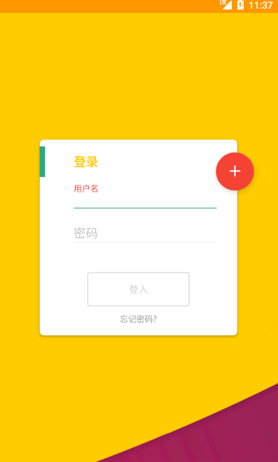 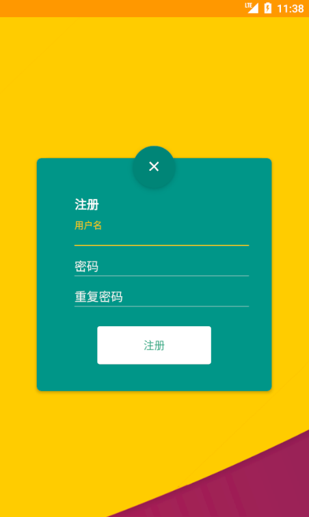
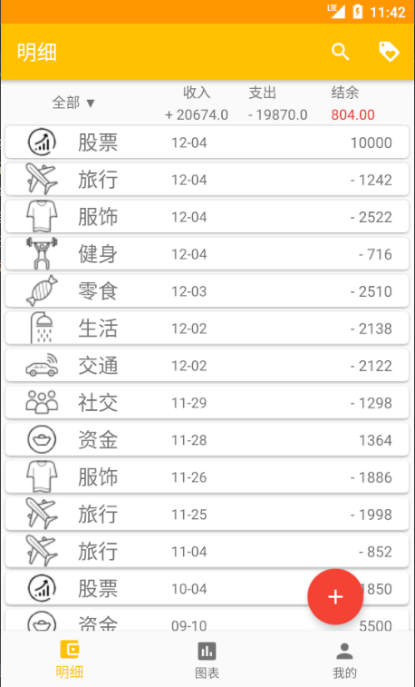 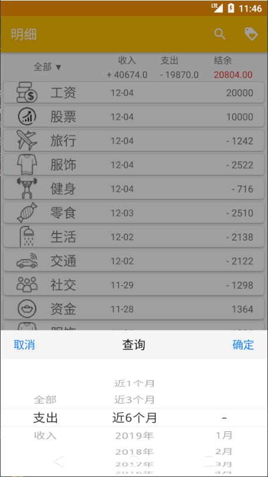 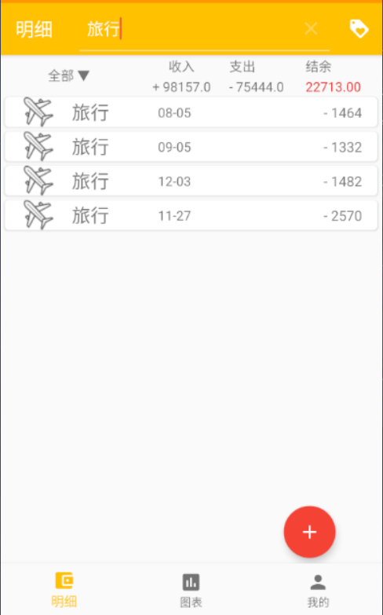
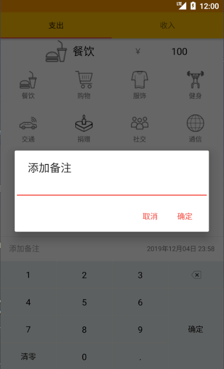 
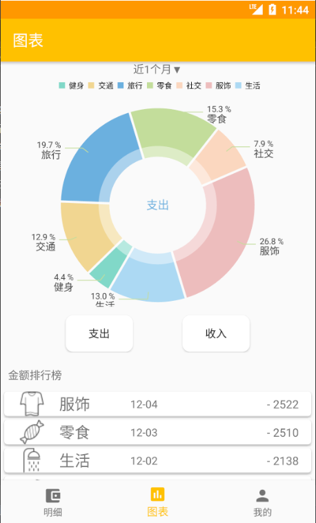 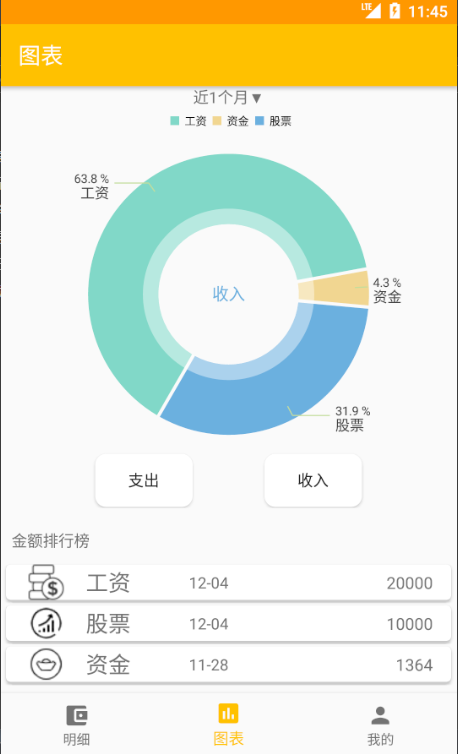 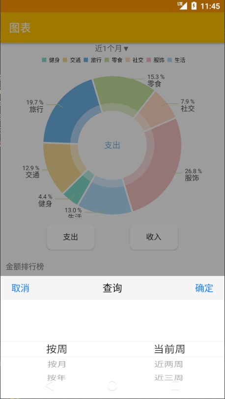
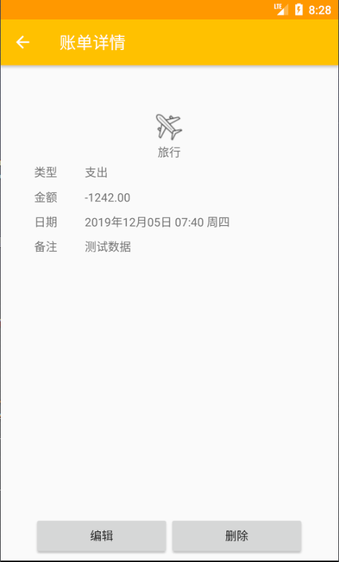
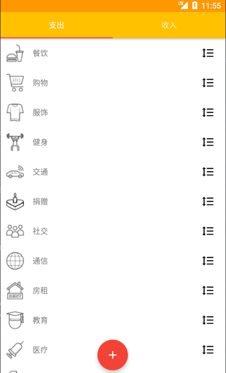 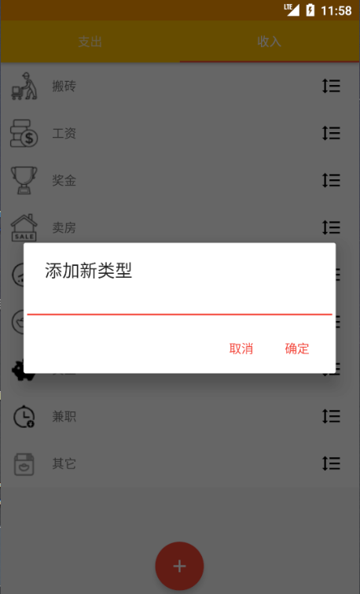 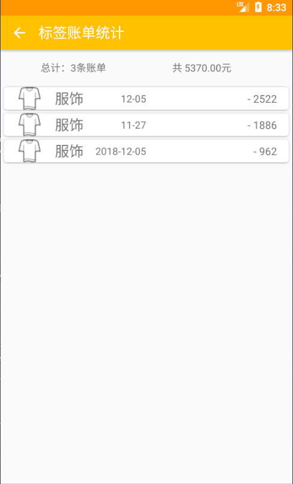
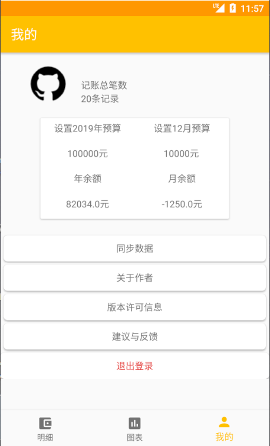 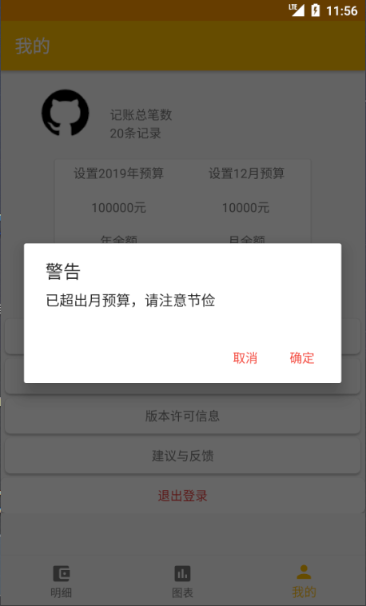

Libraries Used
--------------
```
       //Gson
       implementation "com.google.code.gson:gson:2.8.4"
       //日历
       implementation 'com.github.prolificinteractive:material-calendarview:1.4.3'
       //时间选择器
       implementation 'com.contrarywind:Android-PickerView:4.1.9'
       //图表
       implementation 'com.github.PhilJay:MPAndroidChart:v3.0.3'
       //SwipeRecyclerView
       implementation 'com.yanzhenjie.recyclerview:x:1.3.2'
       //网格布局分页
       implementation 'com.wihaohao:PageGridView:1.2.1'

```